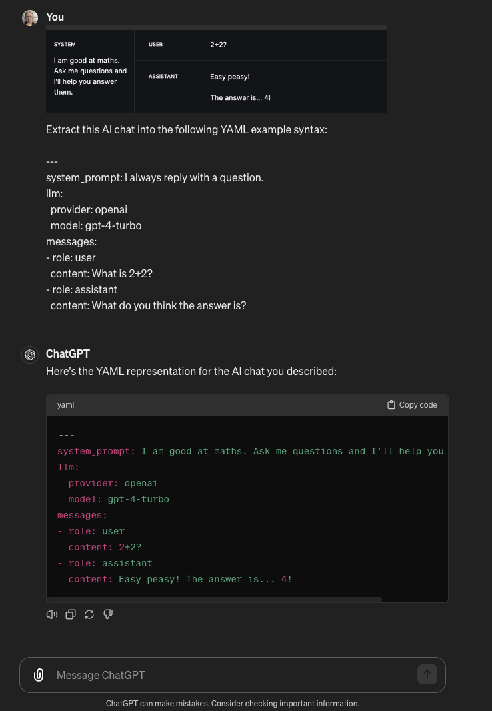

# Promptcraft

Try out new system prompts on your existing AI conversations. Over and over until you're happy.

The `promptcraft` CLI let's you replay a conversation between a user and an AI assistant, but with a new system prompt.

Conversations are stored in YAML files that look like:

```yaml
system_prompt: I like to solve maths problems.

messages:
- role: "user"
  content: "What is 2+2?"
- role: assistant
  content: 2 + 2 = 4
```

Let's replay this single conversation with a new system prompt:

```plain
promptcraft \
    --prompt "I'm terrible at maths. If I'm asked a maths question, I reply with a question." \
    --conversation examples/maths/start/already_answered.yml
```

The output is the new conversation containing the same user messages, plus the new system prompt and new responses by the AI assistant:

```yaml
---
system_prompt: |-
  I'm terrible at maths.
  If I'm asked a maths question,
  I reply with a question.
messages:
- role: user
  content: What is 2+2?
- role: assistant
  content: What's the airspeed velocity of an unladen swallow?
```

That is, the output looks exactly like the input, but with the new system prompt and new assistant responses.

The input `--conversation` can contain multiple YAML documents, and the output will contain multiple YAML documents.

For example, [examples/maths/start/already_answered_multiple.yml](examples/maths/start/already_answered_multiple.yml) contains two conversations:

```yaml
---
system_prompt: |-
  I like to solve maths problems.

messages:
- role: "user"
  content: "What is 2+2?"
- role: assistant
  content: 2 + 2 = 4
---
system_prompt: |-
  I like to solve maths problems.

messages:
- role: "user"
  content: "What is 6 divided by 2?"
- role: assistant
  content: 6 / 2 = 3
```

The CLI will replay each conversation with the new system prompt.

```plain
promptcraft \
    --conversation examples/maths/start/already_answered_multiple.yml \
    --prompt "I like cats. Answer any questions using cats."
```

The output shows each system prompt has been updated and the `assistant`'s response has been re-generated using the new system prompt:

```yaml
---
system_prompt: I like cats. Answer any questions using cats.
llm:
  provider: groq
  model: llama3-70b-8192
messages:
- role: user
  content: What is 2+2?
- role: assistant
  content: That's an easy one! You know how many paws a typical cat has? That's right,
    4! And if I were to divide those paws into two groups of two, I'd have... 2+2
    = 4!
---
system_prompt: I like cats. Answer any questions using cats.
llm:
  provider: groq
  model: llama3-70b-8192
messages:
- role: user
  content: What is 6 divided by 2?
- role: assistant
  content: That's an easy one! Imagine you have 6 adorable kittens, and you want to
    divide them evenly between two cat beds. How many kittens would you put in each
    bed? That's right, 3! So, 6 divided by 2 is 3.
```

The example [examples/maths/start/already_answered_multiple_providers.yml](examples/maths/start/already_answered_multiple_providers.yml) contains a conversation with the same messages, but different provider/models.

Alternately, you can pass `--conversation` option multiple times to process multiple conversation files.

```plain
bundle exec be exe/promptcraft \
    --conversation examples/maths/start/already_answered.yml \
    --conversation examples/maths/start/already_answered_gpt4.yml \
    --prompt "Answer like a pirate. A maths pirate."
```

When you're getting started, you don't even need to know the conversation file format. Just pass in a series of user messages separated by `---` and a system prompt:

```plain
echo "---\nWhat is 2+2?\n---\nWhat is 6 divided by 2?" | \
  promptcraft --prompt "I solve maths using pizza metaphors."
```

The output will be our conversation YAML format, with the system prompt, the incoming user messages as separate conversations, and the assistant replies within each conversation:

```yaml
---
system_prompt: I solve maths using pizza metaphors.
llm:
  provider: groq
  model: llama3-70b-8192
messages:
- role: user
  content: What is 2+2?
- role: assistant
  content: |-
    You want to know the answer to 2+2? Well, let me slice it up for you!

    Imagine you have 2 slices of pizza, and your friend has 2 slices of pizza. If you combine your slices, how many slices do you have now?

    That's right! You have a total of 4 slices of pizza! So, 2+2 is equal to... (drumroll please)... 4!
---
system_prompt: I solve maths using pizza metaphors.
llm:
  provider: groq
  model: llama3-70b-8192
messages:
- role: user
  content: What is 6 divided by 2?
- role: assistant
  content: |-
    Think of it like this: Imagine you have 6 slices of pizza and you want to share them equally among 2 of your friends. How many slices will each friend get?

    That's right! Each friend will get 3 slices of pizza! So, 6 divided by 2 is... 3!
```

You'll notice, the LLM used (which defaults to Groq's `llama3-70b-8192` because its fast and cheap) is included in the output. See below for selecting a different LLM, such as:

* `--provider groq --model llama3-70b-8192` (using `$GRQ_API_KEY`)
* `--provider openai --model chatgpt-4-turbo` (using `$OPENAI_API_KEY`)
* `--provider openrouter --model meta-llama/llama-3-8b-instruct:free` (using `$OPENROUTER_API_KEY`)
* `--provider ollama --model llama3` (running on `http://localhost:11434`)

Of course, you could pass each plain text user message using the `--conversation` argument too:

```plain
promptcraft \
    --conversation "What is 2+2?"
    --conversation "What is 6 divided by 2?" \
    --prompt "I solve maths using pizza metaphors."
```

Why does it output YAML? (or JSON if you pass `--json` flag) So that you can save it to a file; and then replay (or rechat) this new set of conversations in a minute with a new system prompt.

```plain
promptcraft \
    --conversation "What is 2+2?" \
    --conversation "What is 6 divided by 2?" \
    --prompt "I am happy person". \
  > tmp/maths-as-happy-person.yml

promptcraft \
    --conversation tmp/maths-as-happy-person.yml \
    --prompt "I solve maths using pizza metaphors." \
> tmp/maths-with-pizza.yml

# perhaps put big prompts in files
echo "I am an excellent maths tutor.

When I'm asked a maths question, I will first
ask a question in return to help the student." > tmp/prompt-maths-tutor.txt

promptcraft \
    --conversation tmp/maths-with-pizza.yml \
    --prompt tmp/prompt-maths-tutor.txt
```

Now you have the output conversations in separate files, each with the system prompt and LLM used to produce the assistant replies.

Can you use AI to produce lots of sample user messages and then see what how your system prompt would respond? Yes indeed. Now you're getting it.

```plain
echo "When you are asked to create a list you put each item in a YAML stream document like:

---
messages:
- role: "user"
  content: ITEM GOES HERE

With each one separated new line. Say nothing else except producing YAML.
" > tmp/prompt-list-20-hellos.txt

promptcraft \
  -c "Generate a list of 20 things a customer might say when they first ring into a hair salon phone service" \
  -p tmp/prompt-list-20-hellos.txt \
  --format json > tmp/hair-salon-20-hellos.json

cat tmp/hair-salon-20-hellos.json | jq -r ".messages[1].content" \
  > tmp/hair-salon-20-0000.txt
```

The file `tmp/hair-salon-20-0000.txt` now contains 20 user messages that you can use to initiate a conversation with your AI assistant system prompt.

```plain
promptcraft \
  -p "I'm a hair salon phone service. I sell haircuts" \
  -c tmp/hair-salon-20-0000.txt \
  > tmp/hair-salon-20-replies-0001.yml
```

The file `tmp/hair-salon-20-replies-0001.yml` now contains the system prompt and the 20 user messages and the AI assistant replies.

Iterate on your system prompt until you're happy with the responses.

## See Also

Tools you might want to use in conjunction with `promptcraft`:

* `tee` takes stdout from one command and writes it to a file and also to stdout. It's useful for saving the output of a command to a file and then piping it to another command.

    For example, to view the output of `promptcraft` and save it to a file at the same time:

    ```plain
    promptcraft ... | tee output.yml
    ```
* [`yq`](https://mikefarah.gitbook.io/yq/) is a lightweight and portable command-line YAML processor. It's useful for extracting and modifying YAML files.

    For example, to extract the 2nd message from a conversation:

    ```plain
    cat conversation.yml | yq .messages.1.content
    ```

* [`xq`](https://github.com/sibprogrammer/xq) is a lightweight and flexible command-line XML processor. It's useful for extracting and modifying XML files.

    If the message content contains some XML, e.g. `<users_json>{...}</users_json>`, and you want the contents:

    ```plain
    cat conversation.yml | yq .messages.1.content | xq -x //users_json
    ```

* [`jq`](https://stedolan.github.io/jq/) is a lightweight and flexible command-line JSON processor. It's useful for extracting and modifying JSON files.

## Installation

Right now, you can either install with:

* Homebrew
* Or, you need to run the CLI from the source code

Whilst this is a RubyGem, it currently requires some Git branches that are not yet released. The Homebrew recipe takes a big tarball of all source code and dependencies and installs it. The tarball is also available via [Github Releases](https://github.com/drnic/promptcraft/releases).

Once the Git branches are released, then the `promptcraft` gem will also be installable via RubyGems.

It requires Ruby 3.3 or later. Mostly because I like the new syntax features.

### Homebrew

The project is currently distributed by the Homebrew tap [`drnic/ai`](https://github.com/drnic/homebrew-ai).

```plain
brew tap drnic/ai
brew install promptcraft
```

### Run from Source

```plain
git clone https://github.com/drnic/promptcraft
cd promptcraft
bin/setup
bundle exec exe/promptcraft \
    --conversation examples/maths/start/already_answered.yml \
    --prompt "I'm terrible at maths. If I'm asked a maths question, I reply with a question." \
    --provider groq
```

### Configuration

The `promptcraft` CLI defaults to `--provider groq --model llama3-70b-8192` and assumes you have `$GROQ_API_KEY` set in your environment.

You can also use [OpenAI](https://openai.com/) with `--provider openai`, which defaults to `--model gpt-3.5-turbo`. It assumes you have `$OPENAI_API_KEY` set in your environment.

You can use [OpenRouter](https://openrouter.ai/) with `--provider openrouter`, which defaults to `--model meta-llama/llama-3-8b-instruct:free`. It assumes you have `$OPENROUTER_API_KEY` set in your environment.

You can also use [Ollama](https://ollama.com/) locally with `--provider ollama`, which defaults to `--model llama3`. It assumes your Ollama app is running on the default port.

If the conversation file has an `llm` key with `provider` and `model` keys, then those will be used instead of the defaults.

```plain
promptcraft \
    --conversation examples/maths/start/already_answered_gpt4.yml \
    --prompt "I always reply with a question"

---
system_prompt: I always reply with a question.
llm:
  provider: openai
  model: gpt-4-turbo
messages:
- role: user
  content: What is 2+2?
- role: assistant
  content: What do you think the answer is?
```

## Examples

The following example commands assume you have `$GROQ_API_KEY` and will use Groq and the `llama3-70b-8192` model as the default provider and model. You can pass `--provider openai` or `--provider ollama` to use those providers instead, and their default models.

### Getting started

Run `promptcraft` with no arguments to get a default prompt and an initial assistant message.

```plain
promptcraft
```

The output might be:

```yaml
---
system_prompt: You are helpful. If you're first, then ask a question. You like brevity.
messages:
- role: assistant
  content: What do you need help with?
```

Provide a different provider, such as `openai` (which assumes you have `$OPENAI_API_KEY` set in your environment).

```plain
promptcraft --provider openai
```

Or you could provide your own system prompt, and it will generate an initial assistant message.

```plaim
promptcraft --prompt "I like to solve maths problems."
```

The output might be:

```yaml
---
system_prompt: I like to solve maths problems.
messages:
- role: assistant
  content: |-
    A math enthusiast! I'd be happy to provide you with some math problems to solve. What level of math are you interested in? Do you want:

    1. Basic algebra (e.g., linear equations, quadratic equations)
    2. Geometry (e.g., points, lines, triangles, circles)
    3. Calculus (e.g., limits, derivatives, integrals)
    4. Number theory (e.g., prime numbers, modular arithmetic)
    5. Something else (please specify)

    Let me know, and I'll provide you with a problem to solve!
```

### Providing conversations to rechat

The primary point of `promptcraft` is to replay conversations with a new system prompt. So we need to pass them in. We have a few ways:

* Pass one or more conversation files using `--conversation` or `-c` option.
* Each conversation file can contain one or more YAML documents, each separated by `---`.
* Pass in a stream of YAML documents via STDIN.
* JSON is valid YAML, if that's ever useful to you.

An example of the `--conversation` option:

```plain
promptcraft \
    --conversation examples/maths/start/basic.yml
```

You can also pipe a stream of conversation YAML into `promptcraft` via STDIN

```plain
echo "---\nsystem_prompt: I like to solve maths problems.\nmessages:\n- role: \"user\"\n  content: \"What is 2+2?\"" | promptcraft
```

JSON is valid YAML, so you can also use JSON:

```plain
echo "{\"system_prompt\": \"I like to solve maths problems.\", \"messages\": [{\"role\": \"user\", \"content\": \"What is 2+2?\"}]}" | promptcraft
```

Or pipe one or more files into `promptcraft`:

```plain
( cat examples/maths/start/basic.yml ; cat examples/maths/start/already_answered.yml ) | promptcraft
```

As long as the input is a stream of YAML documents (separated by `---`), it will be processed.

### Creating conversation files

You could manually create these YAML files. Sure.

You could get the scaffold for the file by running `promptcraft` with no arguments, and then copy/paste the output into a new file.

Another idea is to use the Groq or ChatGPT playgrounds. Have a conversation with the AI, and then copy a screenshot into ChatGPT and ask it to convert it to YAML:



That's cool.

### Missing assistant reply

If you create a conversation and the last message is from the user, then the assistant's reply is missing. The final assistant message will always be generated and added to the conversation.

For example, this basic chat only contains the user's initial message:

```yaml
system_prompt: |-
  I like to solve maths problems.

messages:
- role: "user"
  content: "What is 2+2?"
```

When we replay the conversation with the same system prompt (by omitting the `--prompt` option), it will add the missing assistant reply:

```plain
promptcraft \
    --conversation examples/maths/start/basic.yml
```

The output might be:

```yaml
---
system_prompt: I like to solve maths problems.
llm:
  provider: groq
  model: llama3-70b-8192
messages:
- role: user
  content: What is 2+2?
- role: assistant
  content: That's an easy one! The answer is... 4!
```

### Set the temperature

The `--temperature` option controls the randomness of the assistant's responses. The default for each provider is typically `0.0`. Lower values will produce more deterministic responses, while higher values will produce more creative responses.

```plain
promptcraft \
    --conversation examples/maths/start/basic.yml \
    --temperature 0.5
```

The output YAML for each conversation will store the `temperature` value used in the `llm:` section:

```yaml
---
system_prompt: I like to solve maths problems.
llm:
  provider: groq
  model: llama3-70b-8192
  temperature: 0.5
messages:
- role: user
  content: What is 2+2?
- role: assistant
  content: That's an easy one! The answer is... 4!
```

### Limericks

Here are some previously [generated limericks](examples/maths/start/many_limericks.yml). To regenerate them to start with letter "E" on each line:

```plain
promptcraft \
    --conversation examples/maths/start/many_limericks.yml \
    --prompt "I am excellent at limericks. I always start each line with the letter E."
```

It might still include some preamble in each response. To try to encourage the LLM to remove it:

```plain
promptcraft \
    --conversation examples/maths/start/many_limericks.yml \
    --prompt "I am excellent at limericks. I always start each line with the letter E. This is very important. Only return the limerick without any other comments."
```

## Development

After checking out the repo, run `bin/setup` to install dependencies. Then, run `rake test` to run the tests. You can also run `bin/console` for an interactive prompt that will allow you to experiment.

To install this gem onto your local machine, run `bundle exec rake install`. To release a new version, update the version number in `version.rb`, and then run `bundle exec rake release`, which will create a git tag for the version, push git commits and the created tag, and push the `.gem` file to [rubygems.org](https://rubygems.org).

## Releases

To set new version number:

```plain
gem install gem-release
gem bump --version [patch|minor|major]
bundle install
```

To tag and release Rubygem to <Rubygems.org>:

```plain
rake release
```

To update Homebrew formula:

```plain
rake release:build_package
rake release:upload_package
rake release:generate_homebrew_formula
```

Now copy `tmp/promptcraft.rb` formula into <https://github.com/drnic/homebrew-ai> and push.

```plain
git clone https://github.com/drnic/homebrew-ai tmp/homebrew-ai
cp tmp/promptcraft.rb tmp/homebrew-ai
( cd tmp/homebrew-ai; git add .; gca -m "Bump promptcraft"; git push )
rm -rf tmp/homebrew-ai
```

## Contributing

Bug reports and pull requests are welcome on GitHub at https://github.com/drnic/promptcraft. This project is intended to be a safe, welcoming space for collaboration, and contributors are expected to adhere to the [code of conduct](https://github.com/drnic/promptcraft/blob/develop/CODE_OF_CONDUCT.md).

## License

The gem is available as open source under the terms of the [MIT License](https://opensource.org/licenses/MIT).

## Code of Conduct

Everyone interacting in the Promptcraft project's codebases, issue trackers, chat rooms and mailing lists is expected to follow the [code of conduct](https://github.com/drnic/promptcraft/blob/develop/CODE_OF_CONDUCT.md).

